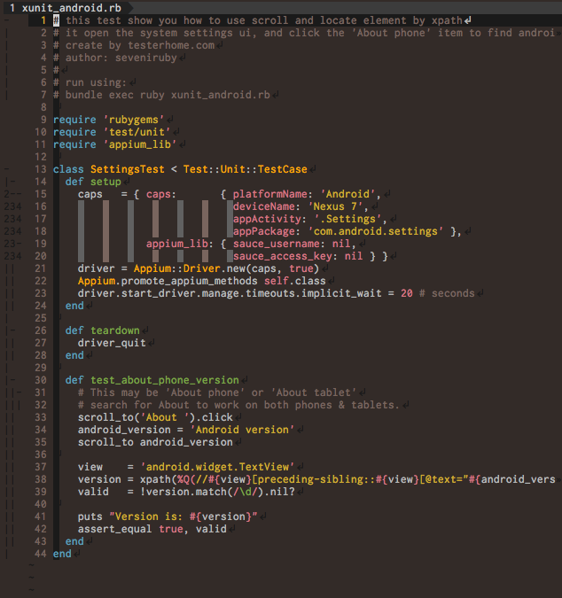
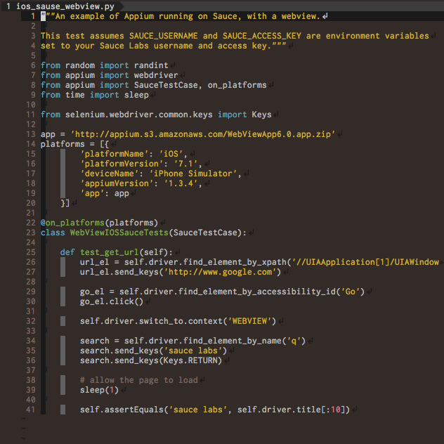
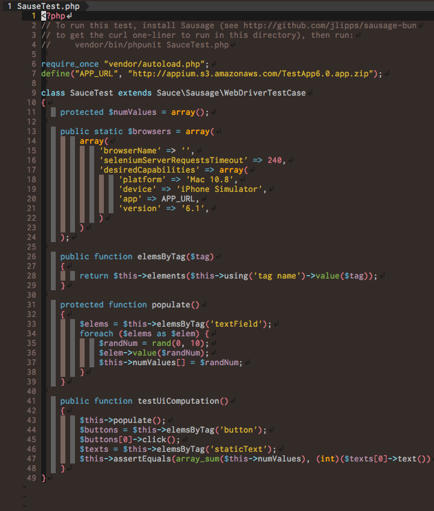
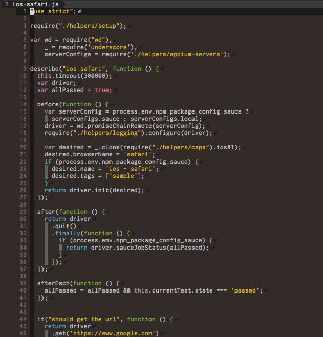

# gochiusa.vim :rabbit:

## Samples

source code from: https://github.com/appium/sample-code

### Ruby



### Python



### PHP



### Node.js



## Installation

```
# .vimrc

colorscheme gochiusa
```

### dein.vim

```
# dein.toml

[[plugins]]
  repo = 'yamasy1549/gochiusa.vim'
```

### others

```
$ git clone https://github.com/yamasy1549/gochiusa.vim
$ cp gochiusa.vim/colors/gochiusa.vim ~/.vim/colors/
```

# Do you use iTerm2?

https://github.com/yamasy1549/iTerm2-gochiusa
